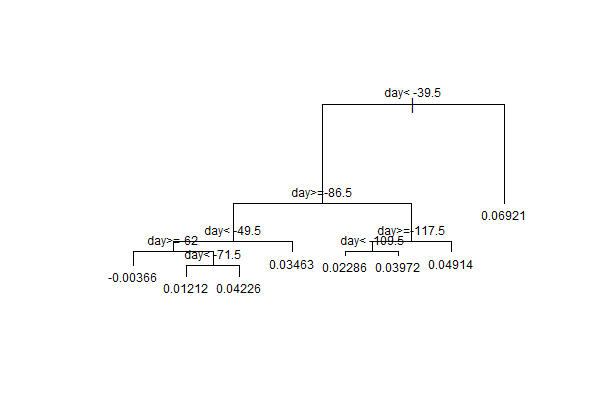
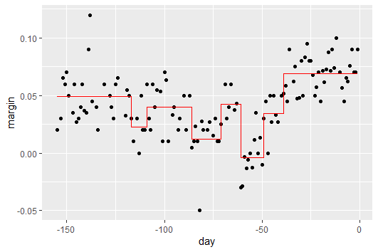
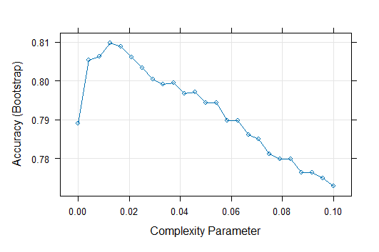
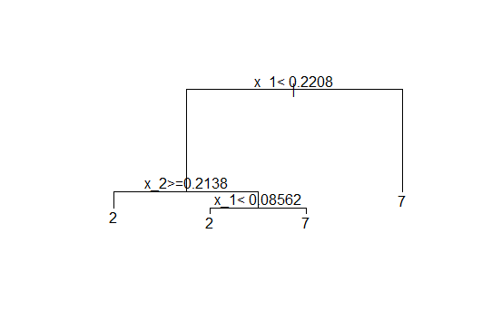

# decision-trees-and-random-forests
Machine learning project using decision trees (rpart) and random forests (randomForest and Rborist) with cross-validation tuning, built in R.

## Overview

This project covers:
- Building a decision tree with the `rpart` package
- Visualizing decision trees
- Evaluating model fit
- Training random forests using `randomForest` and `Rborist`
- Comparing model accuracy using cross-validation

## Visualizations

### 1. Decision Tree Structure (polls_2008 dataset)



**Generated by:**

```r
fit <- rpart(margin ~ ., data = polls_2008)

plot(fit, margin = 0.1)
text(fit, cex = 0.75)
```

### 2. Model Fit vs Actual Data (polls_2008 dataset)

Generated by:

```r
polls_2008 %>%
  mutate(y_hat = predict(fit)) %>%
  ggplot() +
  geom_point(aes(day, margin)) +
  geom_step(aes(day, y_hat), col = "red")
```

### 3. Cross-Validation Plot (Decision Tree on mnist_27 dataset)

Generated by:

```r
train_rpart <- train(y ~ .,
                     method = "rpart",
                     tuneGrid = data.frame(cp = seq(0.0, 0.1, length.out = 25)),
                     data = mnist_27$train)

plot(train_rpart)
```

### 4. Final Decision Tree Structure (mnist_27 dataset)

Generated by:

```r
rpart_accuracy <- confusionMatrix(
  predict(train_rpart, mnist_27$test),
  mnist_27$test$y
)$overall["Accuracy"]

plot(train_rpart$finalModel, margin = 0.1)
text(train_rpart$finalModel)
```
